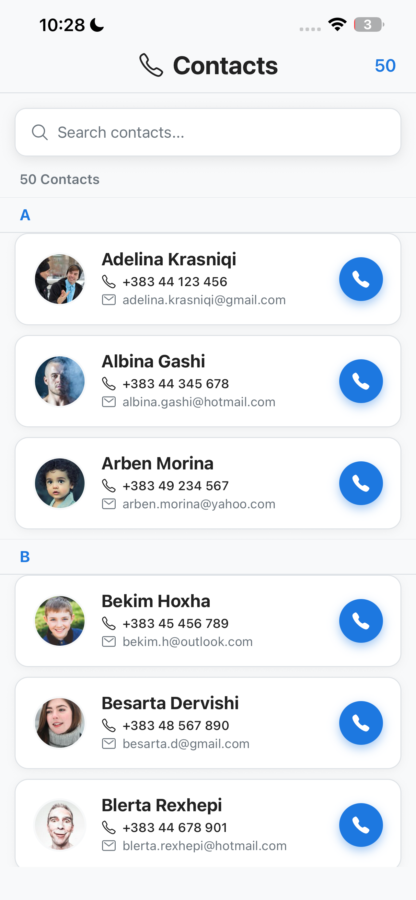
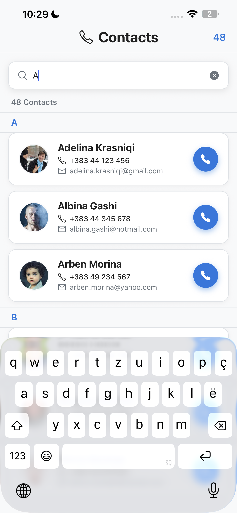
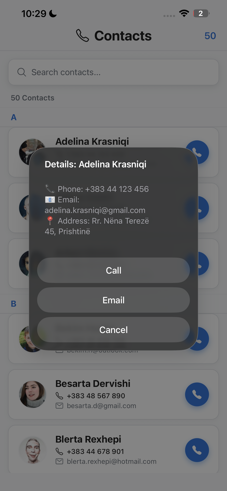
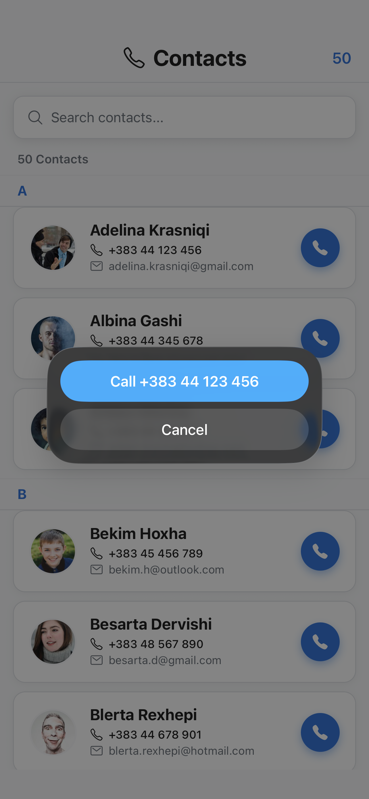

# React Native Contacts App

A simple **Contacts App** built with **React Native** and **Expo**.  
This app lets users view, search, and interact with a list of contacts. You can call or email contacts directly from the app.

---

## Features

- Browse a scrollable list of contacts with avatar, name, phone, and email.
- Search contacts by name, phone, or email.
- Tap a contact to see details (phone, email, address).
- Directly call or email a contact.
- Clean and responsive design for both iOS and Android.

---

## Installation

1. Make sure you have **Node.js**, **npm**, and **Expo CLI** installed.  
2. Clone the repository:

```bash
git clone https://github.com/shefkiees/ContactList.git

```
3. Navigate into the project folder:

```bash
cd ContactList
```
4. Install dependencies:

```bash
npm install
```
5. Start the Expo development server:

```bash
npm start

```
## Usage

- Use the search bar at the top to filter contacts by name, phone, or email.
- Tap a contact card to view more details (phone, email, address) and options to call or email.
- Tap the call button directly on the contact card to make a phone call.
- Tap the email icon or option to open the email app for that contact.

  
## Screenshots

**Contacts List**  


**Contact Details**  


**Contact Details**  


**Contact Details**  



